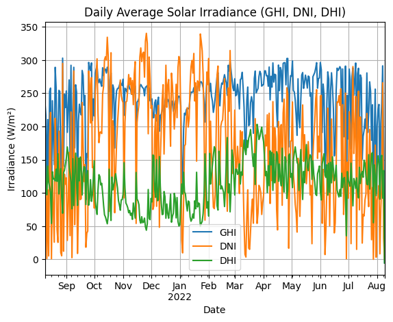
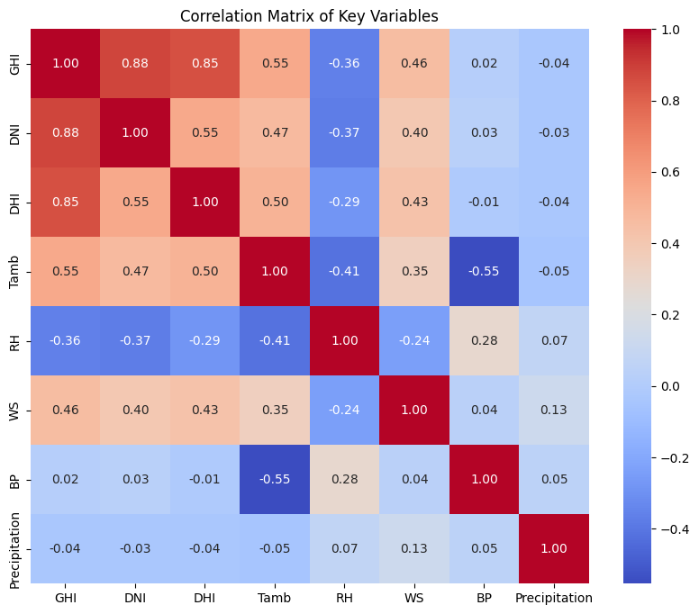

MoonLight Energy Solution
This report is a recommendation that identifies the high-potential regions for solar installations.
This report is prepared for the benin-malanville dataset.
In order to identify the high-potential regions for solar installation based on the given data, first exploratory 
data analysis was performed on the data. We cleared any missing values and NaN values. We then converted the Timestamp 
column into a datetime and set it as index.

After performing the necessary EDA, we plotted the solar irradiance data over time.

The plot shows the daily average values for Global Horizontal Irradiance (GHI), Direct Normal Irradiance (DNI), and Diffuse Horizontal Irradiance (DHI) over the observed period.

We also plotted the correlation between solar irradiance (GHI, DNI, DHI) and other environmental variables like temperature, humidity, wind speed, etc.

Finally the following recommendations are drawn from the plots of the data.

1. Seasonal and Daily Trends in Solar Irradiance

Interpretation: Regions and periods with consistently high Global Horizontal Irradiance (GHI) indicate high solar potential. These regions should be prioritized for solar installations.
Actionable Insight: Focus on installing solar panels in regions where GHI is highest during peak seasons, ensuring that energy capture is maximized year-round.
2. Correlation Analysis

Interpretation: Strong positive correlations between GHI and DNI with ambient temperature (Tamb) suggest that warmer regions may have higher solar potential. Conversely, negative correlations with humidity (RH) might indicate reduced efficiency in more humid areas.
Actionable Insight: Prefer locations where temperature positively influences irradiance, and avoid areas with high humidity or other conditions that negatively affect solar potential.